# ASHEN — لعبة Souls بستايل PS2 للأندرويد

لعبة أكشن-آر بي جي صعبة بأسلوب Dark Souls الأول، بجماليات PlayStation 2:
مضلعات قليلة، نُسج 64×64، ضباب كثيف، إضاءة رؤوس، واهتزاز الرؤوس الشهير.
تُبنى كملف **APK** كامل يعمل على الهاتف.

> **الحالة: الأجزاء 1 و2 و3 مكتملة، والجزء 4 قيد العمل** — المحرك والعرض
> والحركة، ثم القتال بـ16 سلاحًا والحفظ ورفع المستوى، ثم **20 وحشًا و16 زعيمًا**
> بمراحل وبوابات ضباب، ثم **أربع مناطق مترابطة**، و**نظام غنائم** يحكم ترقية
> السلاح، و**صوت مولّد برمجيًا**، و**شخصيات وحوار وتاجر**، و**فخاخ وجدران وهمية**.
> **واجهة اللعبة عربية بالكامل الآن** — تشكيل الحروف وترتيب ثنائي الاتجاه
> وتخطيط من اليمين لليسار. يبقى القوائم الكاملة والتوازن وتوقيع APK.
> خطة الأجزاء الأربعة وحالة كل بند في [`PLAN.md`](PLAN.md).


| الفارس | الجري | تحكم اللمس |
|---|---|---|
|  |  |  |

| ممر الزعيم | نار المخيّم | رفع المستوى |
|---|---|---|
| 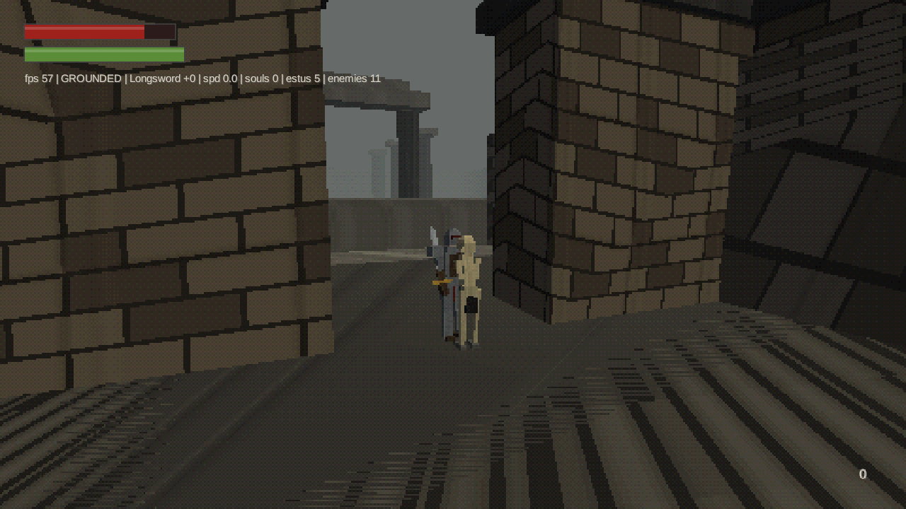 | 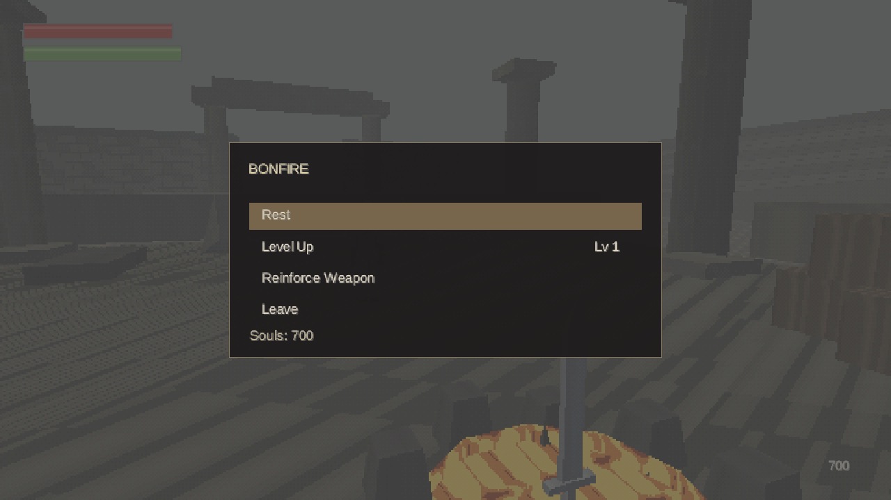 | 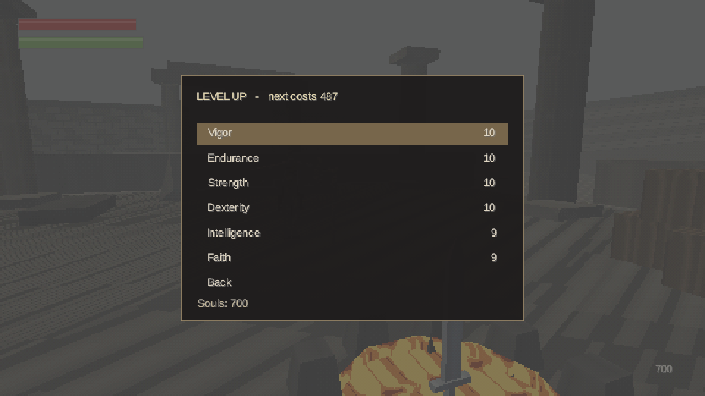 |

| عنكبوت | تنين |
|---|---|
| 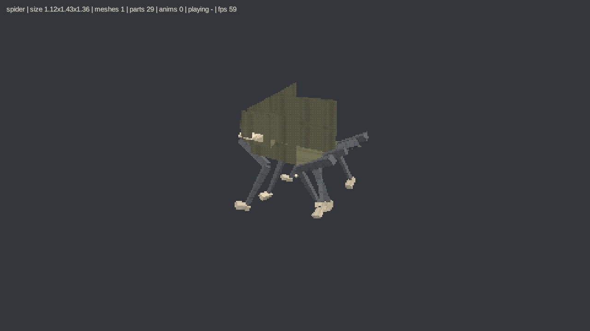 | 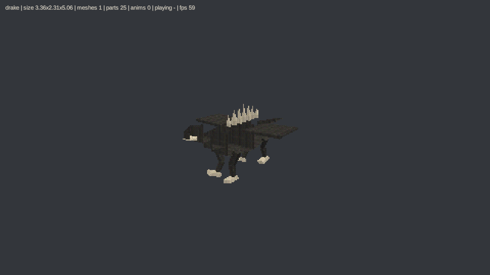 |

الوحوش غير البشرية مبنية من **خطة أطراف** لا من موديل لكل واحد: تغيير عدد أزواج
الأرجل من 2 إلى 4 يحوّل الكلب إلى عنكبوت، ومولّد واحد ومحرّك تحريك واحد يغطّيان
الكلاب والعناكب والخفافيش والأفاعي والتنانين.

### العالم

| بلدة الرماد | السور المكسور | معبد الأعماق |
|---|---|---|
| 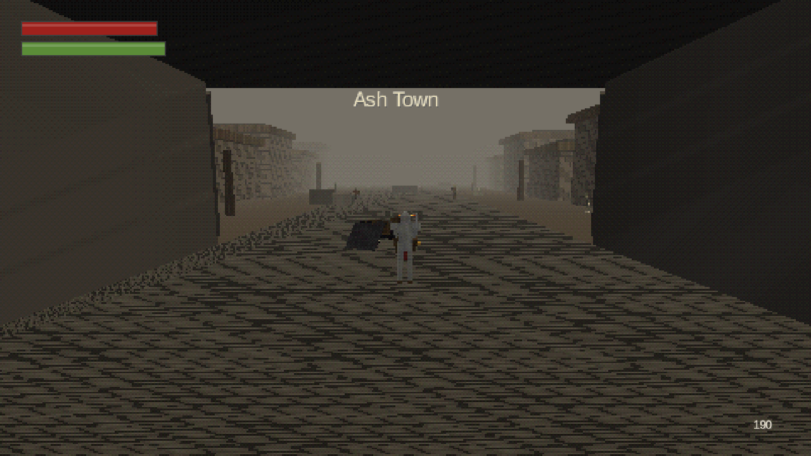 | 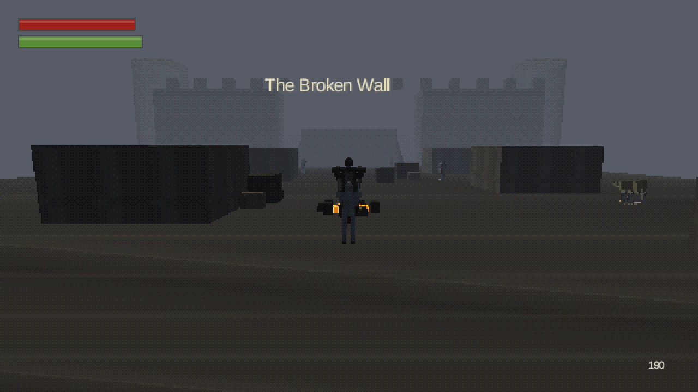 | 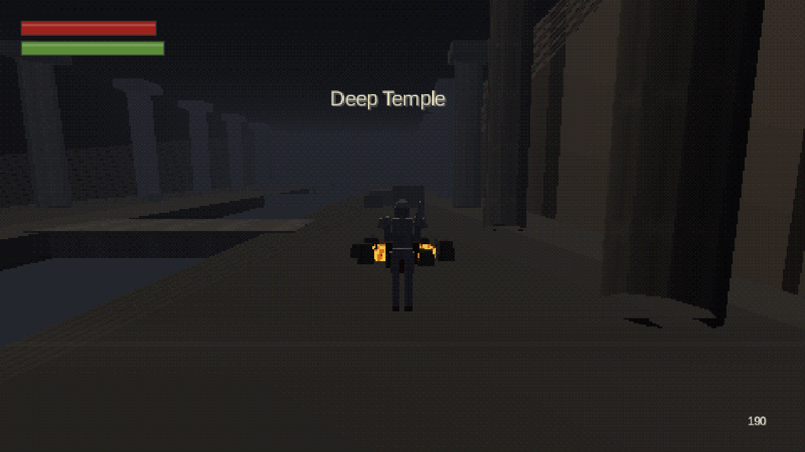 |

أربع مناطق: **ساحة المصح** (البداية) و**بلدة الرماد** (المركز) و**السور المكسور**
و**معبد الأعماق**، وفي كل منها نار مخيّم وأعداؤها الخاصون، وثلاث منها فيها ساحة
زعيم خلف بوابة ضباب. الانتقال ببوابات أحادية الاتجاه: كل منطقة تعلن مخارجها
وأين يهبط اللاعب، فالباب في الاتجاهين بوابتان — وهذا ما يسمح بسقطة لا يمكن
تسلّقها للرجوع، أو بباب يفتح على حافة غير التي غادرتها.

المناطق تُبنى عند دخولها لا كلها معًا: الهاتف لا يتّسع لأربعة مستويات في الذاكرة،
وإعادة البناء بضعة أجزاء من الألف من الثانية لأنها كلها صناديق ومنحدرات.

### الغنائم والعناصر

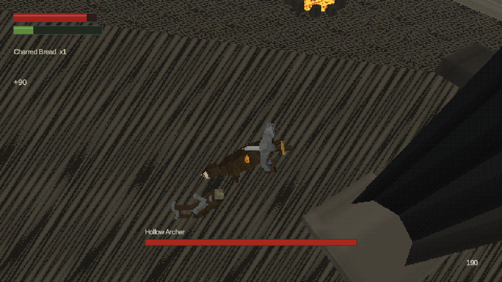

**15 عنصرًا** في [`assets/data/items.json`](assets/data/items.json): طعام وصمغ
يُطلى على النصل وأرواح تُستهلك وعظام عودة وجمرات ترفع سعة القارورة، إضافة إلى
أربع مواد ترقية. لكل وحش وزعيم **جدول غنائم**، وكل صف فيه يُرمى مستقلًا — فالقتلة
قد تعطي لا شيء أو شيئًا واحدًا أو الجدول كله.

الغنيمة تسقط على الأرض عند الجثة لا في الحقيبة مباشرة، وتنتظر نصف ثانية قبل أن
تُلتقط: بدون ذلك تختفي في الإطار نفسه الذي ظهرت فيه، فيُخبَر اللاعب بما حصل عليه
دون أن يرى من أين جاء.

**ترقية السلاح لم تعد أرواحًا فقط.** كل مستوى يطلب مادة أيضًا: شظية جمر حتى +3،
كتلة حتى +6، قلب حتى +9، وقلب الرماد الأول لـ+10 — ولا يحمله إلا الزعيم الأخير.
مواد الزعماء تسقط بنسبة 100%، لأن الزعيم يُقاتَل مرة واحدة ورمية قد تفشل تعني
طريق ترقية مقطوعًا بلا ذنب اللاعب. واختبار آلي يحسب ما تضمنه الزعماء ويتحقق أنه
يكفي فعلًا لسلاح واحد حتى +10.

### الشخصيات والحوار

| حوار | بضاعة التاجر |
|---|---|
| 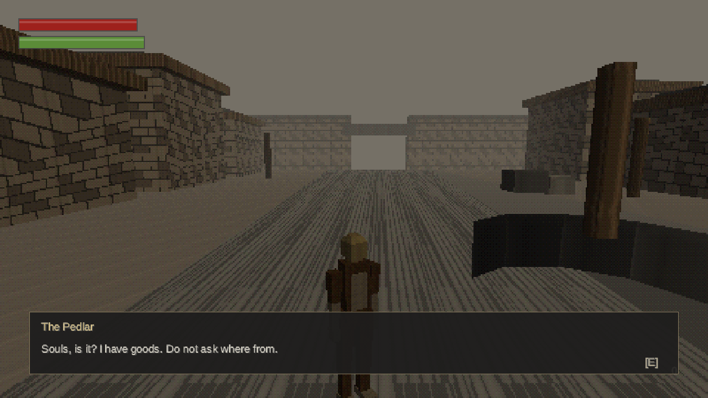 | 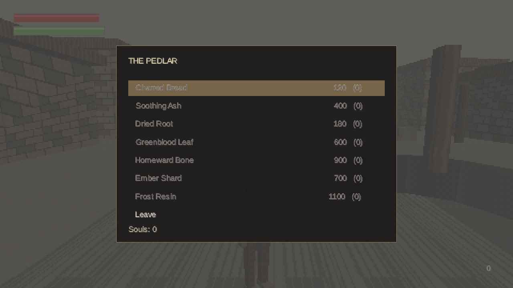 |

خمس شخصيات في ثلاث مناطق. كل واحدة تقول أسطرها بالترتيب ثم يتكرر آخر سطر —
لا يعود إلى أوّله: من يعيد جملته الأولى في كل مرة يبدو آلة، ومن يكرر جملته
الأخيرة يبدو من قال كل ما عنده. أول ضغطة تُنهي ظهور السطر بدل تخطّيه، فمن يقرأ
أسرع من الآلة لا يُعاقَب على ضغطه في وقته.

البائع المتجول يبيع مستهلكات وأدنى مادة ترقية فقط. بضاعته غير محدودة، فبيعه
مادةً أعلى يلغي بوابة الزعماء التي وُجدت هذه المواد لصنعها — واختبار آلي
يتحقق من ذلك. وما لا تكفيه أرواحك يظهر باهتًا قبل أن تضغط، لا بعده.

### اللغة العربية

| الحوار | قائمة نار المخيّم | متجر |
|---|---|---|
| 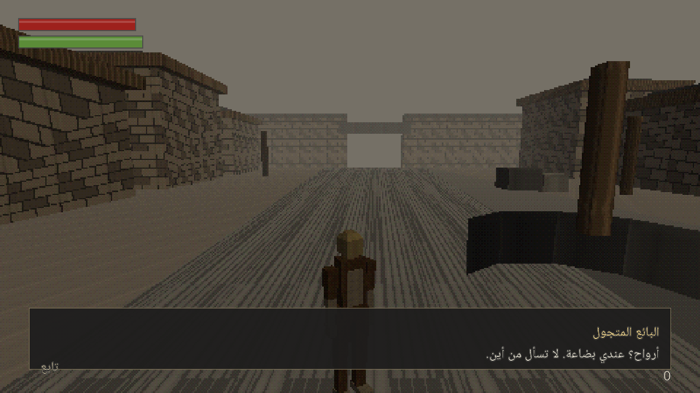 | 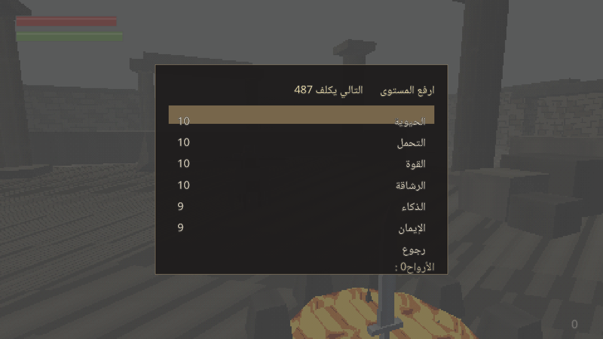 | 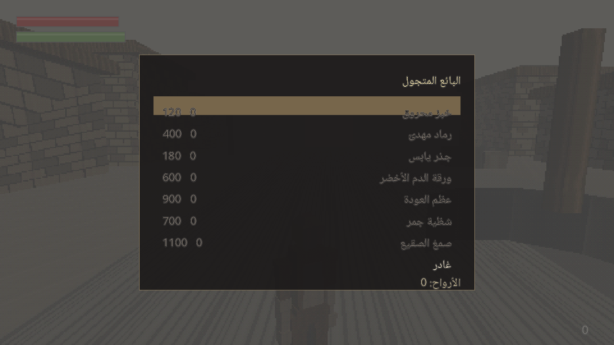 |

libGDX يرسم النص حرفًا حرفًا من اليسار لليمين بلا تشكيل. العربية تحتاج شيئين
لا يفعلهما: **تشكيل الحروف** — لكل حرف حتى أربع صور (مفردة، أولية، وسطية،
نهائية) يحدّدها اتصاله بجيرانه — و**الاتجاه**. الاثنان في
[`core/text/ArabicShaper.java`](core/src/main/java/com/muamn/ashen/text/ArabicShaper.java)،
مع روابط لام-ألف الأربعة، والحركات تُسقَط بدل أن تُرسم في غير موضعها.

الأرقام والكلمات اللاتينية داخل جملة عربية تبقى على اتجاهها: «125» معكوسة
تصير «521» وهذا رقم آخر — خطأ يمرّ من المراجعة لأن لا أحد يقرأ الأرقام.
وعلامات الترقيم لا اتجاه لها بذاتها، فتُحسب في الاتجاه الذي يحيط بها:
هذا بالضبط ما جعل «الأرواح: 0» تظهر أول مرة والنقطتان في الجهة الخطأ من العدد.

والتخطيط نفسه ينقلب: كل سطر يُرسم من الجهة التي تبدأ منها اللغة، والقيمة من
الجهة التي تنتهي عندها. قائمة عربية كل صفوفها تبدأ من اليسار هي أوضح علامة
على لعبة تُرجمت دون أن يُعاد تخطيطها.

`F2` يبدّل بين العربية والإنجليزية، والاختيار يُحفظ.

**الخط:** [Noto Naskh Arabic](https://fonts.google.com/noto/specimen/Noto+Naskh+Arabic)
برخصة OFL. لا يحتوي أي حرف لاتيني — ولا حرفًا واحدًا — فالنص اللاتيني يُرسم
بخط libGDX المدمج والعربي بهذا الخط، ويُختار الخط لكل نص على حدة.

### الفخاخ والأسرار

| نصل متأرجح | فخّ سهام |
|---|---|
| 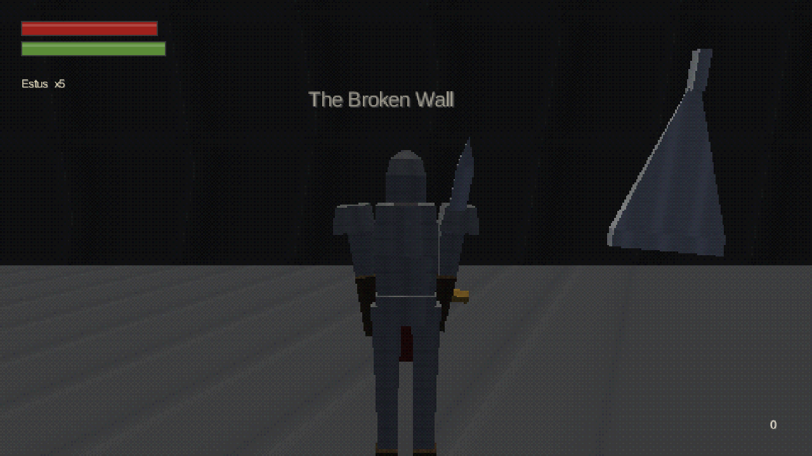 | 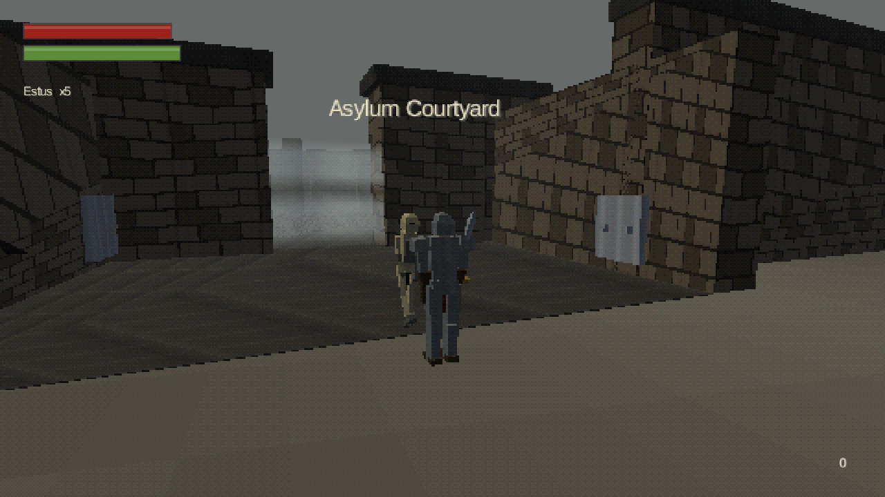 |

ثلاثة أنواع فخاخ: سهام تُطلق عند الاقتراب، ونصال تتأرجح على إيقاعها الخاص بلا
انتظار لأحد، ومسامير تصعد من الأرض. **كلها تُنذر قبل أن تؤذي** — فخّ يقتل بلا
إنذار ليس صعوبة بل اختبار ذاكرة لا يعاقب إلا الجولة الأولى. وضررها يمرّ من نفس
مسار ضربة السيف بلا مهاجم، فتحترم إطارات التدحرج ويمكن صدّها وتكسر الرزانة.

وثلاث **جدران وهمية**، كل واحدة من نفس مادة الجدار الذي تجلس فيه، وكلها في
نهايات مسدودة — سرٌّ لا يمكن الاستدلال عليه ليس سرًّا بل يانصيب. تُكشف بضربة
موجّهة إليها، وما فُتح يبقى مفتوحًا في ملف الحفظ مع ما أُخذ من كنوزها.

---

## التشغيل السريع

**على الحاسوب (للتجربة):**
```bash
./gradlew :lwjgl3:run
```

**تنزيل ملف APK جاهز:**

كل دفعة إلى GitHub تبني ملفين تلقائيًا — `ashen-debug-apk` و`ashen-release-apk` —
وتجدهما في تبويب **Actions ← Build APK ← Artifacts**.

ولإصدار قابل للتنزيل مباشرة بلا حساب GitHub، ادفع وسمًا يبدأ بـ`v`:

```bash
git tag v0.1.0 && git push origin v0.1.0
```

فيُنشَر إصدار في صفحة **Releases** ومعه الملف ومجموع SHA256.

**بناؤه على جهازك:**

```bash
echo "sdk.dir=/path/to/Android/Sdk" > local.properties
./gradlew :android:assembleDebug
# الناتج: android/build/outputs/apk/debug/android-debug.apk
```

**التثبيت:** أندرويد 7.0 (API 24) فأحدث. سيطلب الهاتف السماح بالتثبيت من مصدر
غير معروف — هذا طبيعي لأي APK لا يأتي من متجر Play. الملف موقّع بمفتاح تصحيح،
فيُثبَّت ويُلعب كاملًا لكنه لا يصلح للرفع إلى Play بهذا الشكل.

**الاختبارات:**
```bash
./gradlew :core:test
```

---

## التحكم

| الفعل | الحاسوب | الهاتف |
|---|---|---|
| الحركة | `W A S D` | العصا الافتراضية (النصف الأيسر — تظهر حيث تضع إصبعك) |
| الكاميرا | الماوس أو `I J K L` | السحب على النصف الأيمن |
| الجري | `Shift` | دفع العصا للأقصى واستمرار |
| التدحرج / التراجع | `Space` (بلا حركة = تراجع) | زر `RL` |
| ضربة خفيفة / ثقيلة | زر الفأرة الأيسر / `2` | `R1` / `R2` |
| تبديل السلاح | `Tab` / `~` | — |
| ترقية السلاح ±1 | `=` / `-` | — |
| فتح قائمة نار المخيّم | `E` (بالقرب منها) | `IT` |
| التنقل في القائمة | `W`/`S` أو الأسهم، `Enter` تأكيد، `Esc` رجوع | اللمس على السطر |
| الصد | زر الفأرة الأيمن أو `F` | `L1` |
| الصد المضاد (Parry) | صد + ضربة خفيفة | `L1` + `R1` |
| الطعنة القاضية / الطعن الخلفي | ضربة خفيفة عند الفرصة | `R1` |
| القفل على الهدف | `Q` | `LK` |
| الحديث مع شخصية | `E` (بالقرب منها) | `IT` |
| تقديم الحوار | `E` / `Enter` / `Space` | لمس الشاشة |
| استخدام عنصر | `R` | `IT` |
| تبديل العنصر السريع | `X` | `SW` |
| تبديل اللغة | `F2` | — |
| لوحة التشخيص | `F3` | — |

---

## البنية

```
core/      منطق اللعبة كاملًا (لا يعتمد على منصة)
  render/    أنبوب العرض بستايل PS2 والشيدر المخصص (ثابت + عظمي)
  world/     الاصطدام، بناء المستويات، توليد النُسج، استيراد الأصول
  combat/    الأسلحة، مجموعات الحركات، صناديق الضرر، معادلات القتال
  save/      الحفظ والتحميل
  entity/    اللاعب، الأعداء، الهيكل العظمي، الإحصائيات
  item/      العناصر، جداول الغنائم، المخزون
  audio/     المُركِّب الصوتي، بنك الأصوات، التشغيل
  text/      تشكيل العربية، الترتيب ثنائي الاتجاه، جدول النصوص، الخطوط
  npc/       الشخصيات، الحوار، بضاعة التجّار
  camera/    الكاميرا الثالثة والقفل على الهدف
  input/     تحكم اللمس / لوحة المفاتيح
  ui/        واجهة اللاعب
lwjgl3/    مشغل الحاسوب (تطوير + اختبار آلي)
android/   مشغل الأندرويد وبناء APK
assets/    الشيدرات، بيانات JSON (أسلحة، حركات، وحوش، زعماء، عناصر، شخصيات)، والأصول المستوردة
tools/     محوّل الموديلات glTF → g3dj وسكربت الاستيراد
```

### أدوات التطوير

```bash
./gradlew :lwjgl3:run -Dashen.viewModel=hollow_reaper   # عارض موديلات دوّار
./gradlew :lwjgl3:run -Dashen.autopilot=true            # تشغيل آلي يقاتل بنفسه
./gradlew :lwjgl3:run -Dashen.debug=true                # لوحة تشخيص
./gradlew :lwjgl3:run -Dashen.area=deep_temple          # ابدأ في منطقة معيّنة
./gradlew :lwjgl3:run -Dashen.validateWorld=true        # افحص المناطق والبوابات
./gradlew :lwjgl3:run -Dashen.mute=true                 # بلا صوت
./gradlew :lwjgl3:run -Dashen.talkTo=pedlar             # افتح حوارًا مباشرة
./gradlew :lwjgl3:run -Dashen.lang=en                   # افرض لغة
ASHEN_SOURCE_DIR=~/models ./tools/import_assets.sh      # استيراد موديلات .glb
```

### لماذا هذه القرارات

**libGDX بدل Unity أو Godot.** يبني APK من سطر الأوامر بلا محرر رسومي، وحجم
الملف الناتج ~15MB بدل 60MB+، ويشتغل على أجهزة ضعيفة. وهذا يعني أيضًا أن كل
شيء في هذا المستودع نص برمجي قابل للمراجعة، لا ملفات مشروع ثنائية.

**أصول مولّدة برمجيًا.** بيئة التطوير تحجب مواقع الأصول، لكن الأهم أن الهدف
البصري نفسه — 64×64 بألوان قليلة وترشيح nearest — هو تمامًا ما ينتجه توليد
الضجيج الإجرائي. والنتيجة: لا أصول مفقودة، لا مشاكل ترخيص، وحجم APK صغير.
ومع ذلك، ضع أي ملف في `assets/imported/` وسيُستخدم بدل المولّد تلقائيًا:

```
assets/imported/textures/stone.png       يحل محل نسيج الحجر
assets/imported/models/player.g3dj       يحل محل موديل اللاعب
assets/imported/models/weapon_dagger.g3dj  يحل محل موديل الخنجر
```

المحوّل `tools/glb2g3dj.py` يحوّل `.glb` إلى صيغة libGDX مع العظام والتحريك،
ويصغّر النُسج إلى ميزانية PS2، ويقسّم الشخصيات كثيرة المفاصل لتناسب حدود GLES2.

**صوت مولّد برمجيًا.** نفس قرار النُسج ولنفس الأسباب — لا تحميل، لا تراخيص، لا
ملفات تضيع — لكنه يناسب الصوت أكثر مما يناسب الرسوم: نصلٌ يشقّ الهواء هو ضجيج
تحت مرشّح متحرك، والصدّ المضاد قضيب معدني مطروق، والخطوة نقرة ثم سحجة. لا شيء
من ذلك يحتاج ميكروفونًا. 27 صوتًا تُركَّب عند أول تشغيل (نحو ثلث ثانية) وتُخزَّن
WAV محليًا، مجموعها 1.8 ميغابايت — ثم لا تُركَّب ثانية.

وإن لم يكن في الجهاز مخرج صوت — CI بلا ALSA، أو تطبيق آخر استولى على الصوت —
يُطفئ النظام نفسه ويصبح كل نداء لا يفعل شيئًا. لعبة تنهار لغياب السمّاعة أسوأ
من لعبة صامتة.

**اصطدام مثلثات بدل محرك فيزياء.** عالم اللعبة صناديق ومنحدرات موضوعة يدويًا،
و Bullet كان سيضيف عدة ميغابايت. الشبكة المكانية تعطي دقة كاملة ونتائج حتمية —
وهذا مهم في لعبة تحدد فيها إطارات التدحرج ما إذا كنت ستنجو من الضربة أم لا.

**محاكاة بخطوة ثابتة 60Hz.** لعبة قائمة على نوافذ زمنية للهجوم والحصانة لا
يمكن أن يتغير توقيتها بتغير عدد الإطارات؛ التدحرجة نفسها يجب أن تتفادى الهجوم
نفسه على جهاز 120Hz وعلى هاتف يعاني عند 40.

---

## الجودة

* **166 اختبار وحدة** تغطي الاصطدام، صعود الدرجات، الجاذبية، الستامينا، الإحصائيات،
  بيانات الأسلحة الـ16، منحنى التدرّج، نوافذ الضرب والصد، صيغة ملف الحفظ
  (بما فيها توافق النسخ الأقدم)، اقتصاد الأرواح، العشرين وحشًا والستة عشر زعيمًا
  — أسماؤها وأسلحتها ونوافذ العقاب وعتبات المراحل — وجدول العناصر وجداول
  الغنائم والمخزون: نسب السقوط، سعة الأكوام، ترميز الحفظ وصموده أمام مدخلات
  فاسدة، وأن ما يضمنه الزعماء من مواد يكفي لسلاح واحد حتى +10. ويغطّي الصوت
  أيضًا: ترويسة WAV التي يقرأها المفكّك، وأن كل صوت مسموع ولا يقصّ ولا يبدأ أو
  ينتهي في منتصف موجة، وأن الحلقات تلتقي بلا خيط، وأن كل صوت يخرج كما هو في كل
  تشغيل — واختبار الإشباع كشف فعلًا أن `saturate` كان يتجاوز المدى الكامل عند
  دخل أعلى من واحد.
* **اختبار تشغيل آلي**: CI يشغّل اللعبة الحقيقية 20 ثانية على معالج رسومي برمجي
  بإدخال مبرمج (جري + تدحرج + اصطدام) ويلتقط صورة. أي انهيار في العرض أو
  الحركة يُسقط البناء.
* **فحص محتوى APK**: بعد بنائه، CI يفكّ الملف ويتأكد أن فيه الشيدرات وملفات
  JSON والخط ومكتبات libGDX وFreeType الأصلية لكل معماريات المعالج الأربع.
  ملفٌ يُبنى ليس ملفًا يعمل: نقص `libgdx-freetype.so` مثلًا يُثبَّت بلا شكوى
  ثم تعود الواجهة كلها إنجليزية بصمت — وهذا ما لا يظهر في سجل البناء أبدًا.
* **فحص العالم** (`WorldValidator`): CI يبني المناطق الأربع ويفشل البناء إن كانت
  بوابة تقود إلى منطقة غير موجودة، أو منطقة بلا نار مخيّم أو بلا مخرج أو لا
  يمكن الوصول إليها من البداية، أو ساحة زعيم بداخلها نار مخيّم أو عدو عادي أو
  مخرج أو نقطة هبوط. هذا الفحص يحتاج سياق رسومي لبناء النُسج فلا يصلح اختبار
  وحدة — وقد كشف أول تشغيل له ثلاث علل حقيقية: بوابتان تهبطان داخل ساحة زعيم،
  وبوابة ضباب موضوعة في غير فتحة سور الساحة. ويطلق كذلك شعاعًا على كل جدار
  وهمي ليتأكد أنه صلب فعلًا: لو لم تُربط طبقة اصطدامه لبدا الجدار مثاليًا ومرّ
  اللاعب من خلاله، ولا شيء آخر في البناء كان سيلاحظ.
* **اختبارات النص العربي** (39 اختبارًا): العربية تفشل بصمت — الكلمات كلها
  موجودة ومكتوبة صحيحًا وبالترتيب، وتبدو خاطئة فقط لمن يقرأ اللغة. لا استثناء
  ولا مربّع فارغ يلفت النظر. لذا لكل قاعدة حالة صريحة مكتوبة مقابل ناتج معروف
  الصحة: الصور الأربع لكل حرف، والحروف التي تقطع الكلمة، وروابط لام-ألف، ثم
  قواعد الاتجاه — وقد كشفت علّتين حقيقيتين قبل أن تصلا الشاشة.
* تلك الاختبارات كشفت فعليًا عللًا حقيقية أثناء التطوير: اهتزاز حالة الوقوف على
  حواف المثلثات، فشل صعود الدرجات، تكرار حدث الهبوط كل إطار، وخللًا في معادلة
  الصد جعل الدرع الأثقل يستهلك ستامينا **أكثر** من الأخف.

## الترخيص

كل الأصول الأساسية مولّدة برمجيًا داخل هذا المستودع، فاللعبة تعمل كاملة بلا أي
ملف خارجي. الموديلات المستوردة اختيارية، وتراخيصها ونسبتها لأصحابها في
[`CREDITS.md`](CREDITS.md) — وبعضها لا يجوز إعادة توزيعه فهو غير مرفوع هنا.
