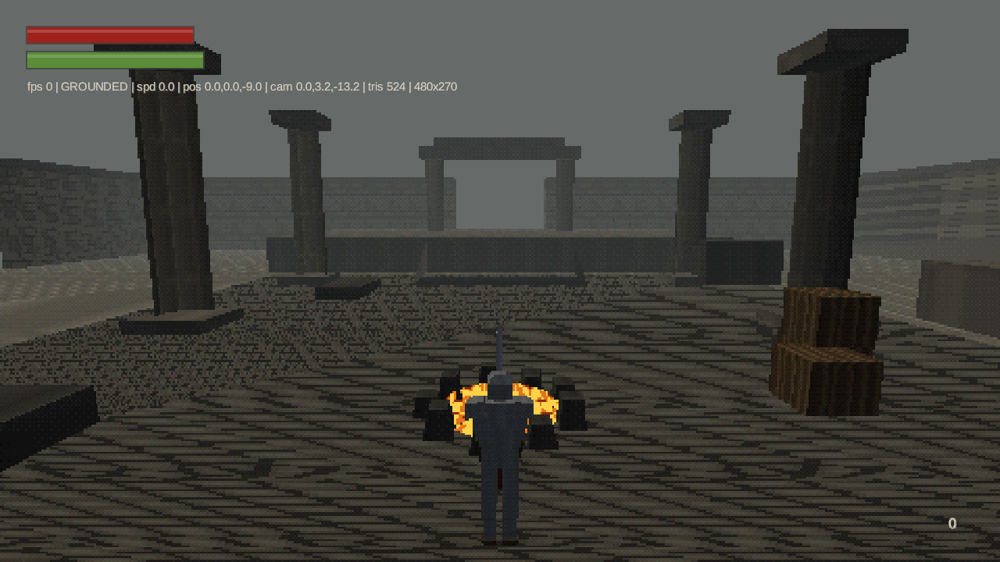
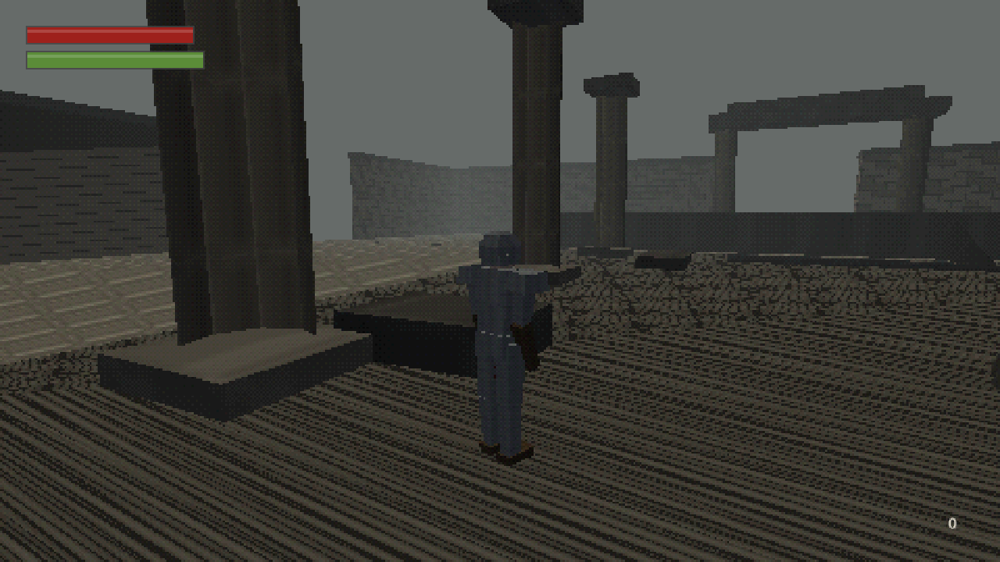
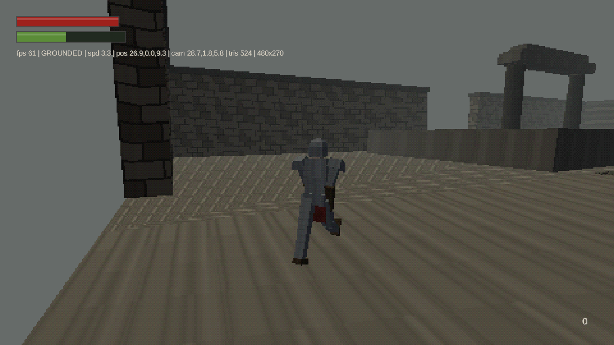
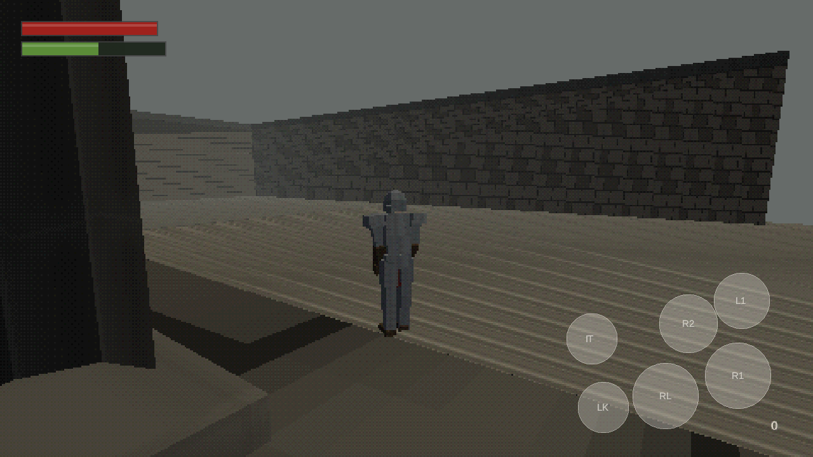

# ASHEN — لعبة Souls بستايل PS2 للأندرويد

لعبة أكشن-آر بي جي صعبة بأسلوب Dark Souls الأول، بجماليات PlayStation 2:
مضلعات قليلة، نُسج 64×64، ضباب كثيف، إضاءة رؤوس، واهتزاز الرؤوس الشهير.
تُبنى كملف **APK** كامل يعمل على الهاتف.

> **الحالة: الجزء 1 مكتمل، والجزء 2 يعمل** — المحرك والعرض والحركة، ثم القتال:
> 16 سلاحًا، صناديق ضرر، رزانة وترنّح، أعداء بذكاء اصطناعي، أرواح ونار مخيّم.
> خطة الأجزاء الأربعة وحالة كل بند في [`PLAN.md`](PLAN.md).



| الفارس | الجري | تحكم اللمس |
|---|---|---|
|  |  |  |

---

## التشغيل السريع

**على الحاسوب (للتجربة):**
```bash
./gradlew :lwjgl3:run
```

**بناء ملف APK:**

Android SDK مطلوب. إن لم يكن مثبتًا عندك، كل دفعة إلى GitHub تبني الملف تلقائيًا
وتجده في تبويب **Actions ← Build APK ← ashen-debug-apk**.

```bash
echo "sdk.dir=/path/to/Android/Sdk" > local.properties
./gradlew :android:assembleDebug
# الناتج: android/build/outputs/apk/debug/android-debug.apk
```

**الاختبارات:**
```bash
./gradlew :core:test
```

---

## التحكم

| الفعل | الحاسوب | الهاتف |
|---|---|---|
| الحركة | `W A S D` | العصا الافتراضية (النصف الأيسر — تظهر حيث تضع إصبعك) |
| الكاميرا | الماوس أو `I J K L` | السحب على النصف الأيمن |
| الجري | `Shift` | دفع العصا للأقصى واستمرار |
| التدحرج / التراجع | `Space` (بلا حركة = تراجع) | زر `RL` |
| ضربة خفيفة / ثقيلة | زر الفأرة الأيسر / `2` | `R1` / `R2` |
| تبديل السلاح | `Tab` / `~` | — |
| ترقية السلاح ±1 | `=` / `-` | — |
| فتح قائمة نار المخيّم | `E` (بالقرب منها) | `IT` |
| التنقل في القائمة | `W`/`S` أو الأسهم، `Enter` تأكيد، `Esc` رجوع | اللمس على السطر |
| الصد | زر الفأرة الأيمن أو `F` | `L1` |
| الصد المضاد (Parry) | صد + ضربة خفيفة | `L1` + `R1` |
| الطعنة القاضية / الطعن الخلفي | ضربة خفيفة عند الفرصة | `R1` |
| القفل على الهدف | `Q` | `LK` |
| استخدام عنصر | `R` | `IT` |
| لوحة التشخيص | `F3` | — |

---

## البنية

```
core/      منطق اللعبة كاملًا (لا يعتمد على منصة)
  render/    أنبوب العرض بستايل PS2 والشيدر المخصص (ثابت + عظمي)
  world/     الاصطدام، بناء المستويات، توليد النُسج، استيراد الأصول
  combat/    الأسلحة، مجموعات الحركات، صناديق الضرر، معادلات القتال
  entity/    اللاعب، الأعداء، الهيكل العظمي، الإحصائيات
  camera/    الكاميرا الثالثة والقفل على الهدف
  input/     تحكم اللمس / لوحة المفاتيح
  ui/        واجهة اللاعب
lwjgl3/    مشغل الحاسوب (تطوير + اختبار آلي)
android/   مشغل الأندرويد وبناء APK
assets/    الشيدرات، بيانات الأسلحة JSON، والأصول المستوردة
tools/     محوّل الموديلات glTF → g3dj وسكربت الاستيراد
```

### أدوات التطوير

```bash
./gradlew :lwjgl3:run -Dashen.viewModel=hollow_reaper   # عارض موديلات دوّار
./gradlew :lwjgl3:run -Dashen.autopilot=true            # تشغيل آلي يقاتل بنفسه
./gradlew :lwjgl3:run -Dashen.debug=true                # لوحة تشخيص
ASHEN_SOURCE_DIR=~/models ./tools/import_assets.sh      # استيراد موديلات .glb
```

### لماذا هذه القرارات

**libGDX بدل Unity أو Godot.** يبني APK من سطر الأوامر بلا محرر رسومي، وحجم
الملف الناتج ~15MB بدل 60MB+، ويشتغل على أجهزة ضعيفة. وهذا يعني أيضًا أن كل
شيء في هذا المستودع نص برمجي قابل للمراجعة، لا ملفات مشروع ثنائية.

**أصول مولّدة برمجيًا.** بيئة التطوير تحجب مواقع الأصول، لكن الأهم أن الهدف
البصري نفسه — 64×64 بألوان قليلة وترشيح nearest — هو تمامًا ما ينتجه توليد
الضجيج الإجرائي. والنتيجة: لا أصول مفقودة، لا مشاكل ترخيص، وحجم APK صغير.
ومع ذلك، ضع أي ملف في `assets/imported/` وسيُستخدم بدل المولّد تلقائيًا:

```
assets/imported/textures/stone.png       يحل محل نسيج الحجر
assets/imported/models/player.g3dj       يحل محل موديل اللاعب
assets/imported/models/weapon_dagger.g3dj  يحل محل موديل الخنجر
```

المحوّل `tools/glb2g3dj.py` يحوّل `.glb` إلى صيغة libGDX مع العظام والتحريك،
ويصغّر النُسج إلى ميزانية PS2، ويقسّم الشخصيات كثيرة المفاصل لتناسب حدود GLES2.

**اصطدام مثلثات بدل محرك فيزياء.** عالم اللعبة صناديق ومنحدرات موضوعة يدويًا،
و Bullet كان سيضيف عدة ميغابايت. الشبكة المكانية تعطي دقة كاملة ونتائج حتمية —
وهذا مهم في لعبة تحدد فيها إطارات التدحرج ما إذا كنت ستنجو من الضربة أم لا.

**محاكاة بخطوة ثابتة 60Hz.** لعبة قائمة على نوافذ زمنية للهجوم والحصانة لا
يمكن أن يتغير توقيتها بتغير عدد الإطارات؛ التدحرجة نفسها يجب أن تتفادى الهجوم
نفسه على جهاز 120Hz وعلى هاتف يعاني عند 40.

---

## الجودة

* **49 اختبار وحدة** تغطي الاصطدام، صعود الدرجات، الجاذبية، الستامينا، الإحصائيات،
  بيانات الأسلحة الـ16، منحنى التدرّج، نوافذ الضرب والصد، صيغة ملف الحفظ
  (بما فيها توافق النسخ الأقدم)، واقتصاد الأرواح.
* **اختبار تشغيل آلي**: CI يشغّل اللعبة الحقيقية 20 ثانية على معالج رسومي برمجي
  بإدخال مبرمج (جري + تدحرج + اصطدام) ويلتقط صورة. أي انهيار في العرض أو
  الحركة يُسقط البناء.
* تلك الاختبارات كشفت فعليًا عللًا حقيقية أثناء التطوير: اهتزاز حالة الوقوف على
  حواف المثلثات، فشل صعود الدرجات، تكرار حدث الهبوط كل إطار، وخللًا في معادلة
  الصد جعل الدرع الأثقل يستهلك ستامينا **أكثر** من الأخف.

## الترخيص

كل الأصول الأساسية مولّدة برمجيًا داخل هذا المستودع، فاللعبة تعمل كاملة بلا أي
ملف خارجي. الموديلات المستوردة اختيارية، وتراخيصها ونسبتها لأصحابها في
[`CREDITS.md`](CREDITS.md) — وبعضها لا يجوز إعادة توزيعه فهو غير مرفوع هنا.
