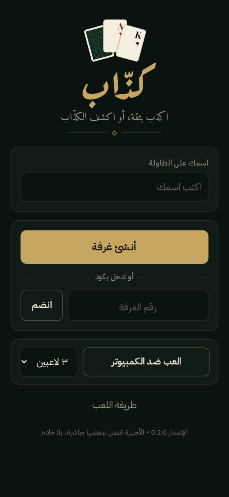
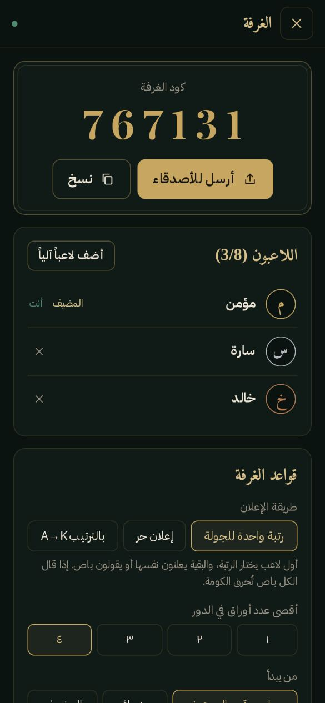
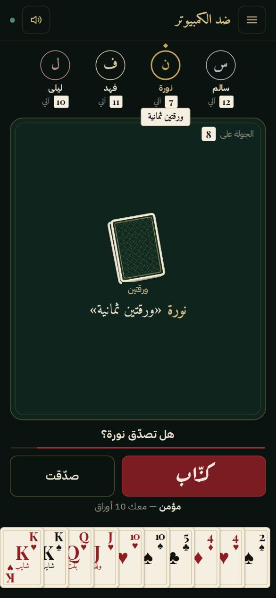
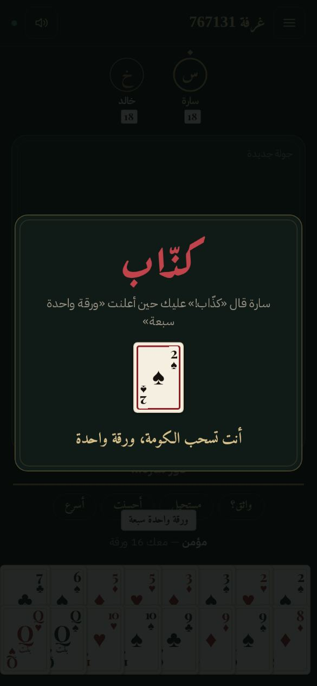
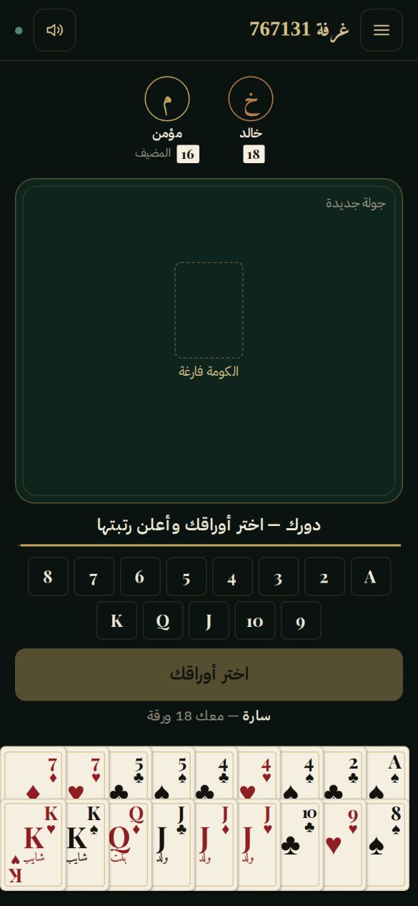
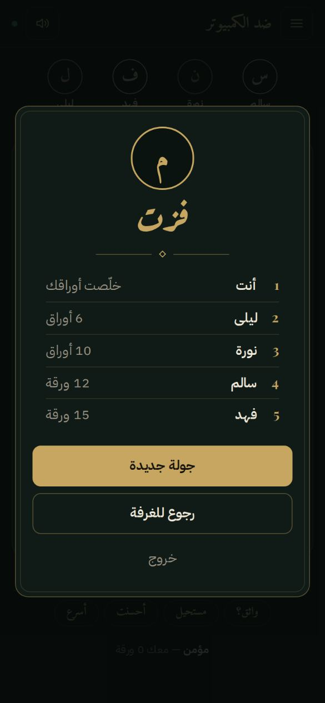

# كذّاب — لعبة الورق مع أصدقائك بكود غرفة

لعبة «كذّاب» على الجوال: كل لاعب يضع أوراقه مقلوبة ويعلن رتبتها — صادقاً أو
كاذباً — والبقية أمامهم ثوانٍ ليصرخوا **كذّاب!**. من يتخلّص من كل أوراقه أولاً
يفوز.

واحد منكم ينشئ غرفة فيظهر له **كود من ٦ أرقام**، يرسله في واتساب، والبقية
يكتبونه ويدخلون. من ٣ إلى ٨ لاعبين، والعربية في كل مكان، والإعلان يُقرأ بصوت
عالٍ. ويمكن اللعب ضد الكمبيوتر بلا إنترنت.

| الرئيسية | الغرفة والكود | لحظة «كذّاب!» |
|---|---|---|
|  |  |  |

| الكشف | دورك | الفوز |
|---|---|---|
|  |  |  |

> هذه الصور ليست تصميماً: التقطها اختبار آلي أثناء لعب حقيقي بين ثلاثة متصفحات
> متصلة ببعضها (`npm run e2e`).

---

## كيف أحصل عليها على هاتفي؟

### ١. تطبيق أندرويد (APK)

**من الهاتف مباشرة:** افتح
<https://github.com/Muamn7/Muamn7/releases/download/kazzab-latest/Kazzab.apk>
فيُنزَّل التطبيق، ثم افتحه وثبّته. الرابط ثابت ويُحدَّث بآخر نسخة مع كل
تعديل تنجح اختباراته (صفحة الإصدار:
[kazzab-latest](https://github.com/Muamn7/Muamn7/releases/tag/kazzab-latest)).

أو من صفحة البناء نفسها:

1. افتح تبويب **Actions** في GitHub ← **Kazzab** ← آخر تشغيل ناجح.
2. نزّل **kazzab-release-apk** من قسم Artifacts (يصل ملف zip، فكّه).
3. انقل `app-release.apk` إلى الهاتف وثبّته (اسمح بالتثبيت من مصدر غير معروف).

أو انشره كإصدار يُنزَّل مباشرة من الهاتف بلا حساب GitHub: **Actions ← Kazzab ←
Run workflow** وفعّل **Publish a downloadable release with the APK**. (زر
Run workflow يظهر بعد دمج هذا الفرع في الفرع الرئيسي للمستودع.)

### ٢. رابط ويب — يعمل على أندرويد وآيفون بلا تثبيت

مرة واحدة: **Settings ← Pages ← Source: GitHub Actions**. بعدها **Actions ←
Kazzab ← Run workflow** مع **Publish the web version to GitHub Pages**. تصبح
اللعبة على رابط مثل `https://muamn7.github.io/Muamn7/` — وزر «أرسل للأصدقاء»
يرسل الرابط والكود معاً، فمن يضغطه يجد الكود مكتوباً.

من يلعب من التطبيق ومن يلعب من الرابط يلعبون معاً في الغرفة نفسها.

### ٣. على الكمبيوتر للتجربة

```bash
cd kazzab
npm install
npm run serve        # http://localhost:8080
```

---

## القواعد

- **الهدف:** تخلّص من كل أوراقك قبل الجميع.
- **التوزيع:** الشدّة كاملة (٥٢ ورقة) بالتساوي حتى نفادها؛ يبدأ صاحب آس البستوني ♠،
  واللعب باتجاه عقارب الساعة.
- **دورك:** ضع من ورقة إلى أربع مقلوبة وأعلن رتبتها. الإعلان صحيح أو كذب — لك.
- **كذّاب!:** بعد كل إعلان، لكل لاعب آخر ثوانٍ ليضغط «كذّاب!»:
  - كان يكذب ← **هو** يسحب الكومة كلها، ومن كشفه يبدأ الجولة الجديدة.
  - كان صادقاً ← **المشكّك** يسحب الكومة كلها، والصادق يبدأ.
- **الفوز:** من يضع آخر ورقة ولا يُكشف كذبه. إن كُشف بآخر ورقة سحب الكومة وأكمل.

### قواعد الغرفة (يختارها المضيف)

| القاعدة | الخيارات | الافتراضي |
|---|---|---|
| طريقة الإعلان | **رتبة واحدة للجولة** · إعلان حر · بالترتيب A→K | رتبة واحدة |
| أقصى أوراق في الدور | ١ · ٢ · ٣ · ٤ | ٤ |
| من يبدأ | صاحب آس ♠ · عشوائي · المضيف | صاحب آس ♠ |
| مهلة «كذّاب!» | ٤ · ٦ · ١٠ ثوانٍ | ٦ |
| مهلة الدور | ٣٠ · ٦٠ ثانية · بلا مهلة | ٦٠ |

**رتبة واحدة للجولة** هي الطريقة المعروفة: أول لاعب يختار الرتبة، ومن بعده يعلن
الرتبة نفسها أو يقول **باص**. إذا قال الجميع باص تُحرق الكومة (تخرج من اللعب)
ويبدأ آخر من لعب جولة جديدة. هذه الطريقة هي التي تجبرك على الكذب — في «الإعلان
الحر» يستطيع كل لاعب أن يصدق دائماً، فتقلّ الإثارة.

إذا انتهت مهلة دورك يقول اللعب عنك **باص** إن أمكن، ولا يكذب نيابة عنك أبداً.
وإذا انقطع اتصال لاعب يلعب الكمبيوتر مكانه حتى يرجع — ويرجع إلى مقعده وأوراقه
نفسها بإدخال الكود مجدداً.

---

## كيف يعمل اللعب عبر الإنترنت بلا خادم؟

لا يوجد خادم لعبة. هاتف من ينشئ الغرفة **هو** الخادم:

1. يسجّل نفسه عند وسيط PeerJS المجاني باسم `kazzab-v1-<الكود>`.
2. الهاتف الذي يكتب الكود يسأل الوسيط عن هذا الاسم فيعرّفه به.
3. بعد التعارف يتصل الهاتفان **مباشرة** (WebRTC)، أو عبر خادم TURN الخاص بـ
   PeerJS إذا منعت شبكتا الجوال الاتصال المباشر.

اللعبة كلها تجري على هاتف المضيف، وكل هاتف آخر لا يستلم إلا ما يحقّ لصاحبه أن
يراه: أوراقه هو، وعدد أوراق الآخرين، وما أُعلن. لا أحد يستطيع رؤية أوراق غيره
بفتح أدوات المطوّر في متصفحه — ببساطة لم تُرسَل إليه.

**ما يعنيه هذا عملياً:**

- **المضيف يبقى في اللعبة.** إذا أغلق التطبيق أو خرج تنتهي الغرفة للجميع
  (ويظهر لهم ذلك). التطبيق يُبقي الشاشة مضاءة أثناء اللعب.
- كل من في الغرفة يحتاج إنترنت. اللعب ضد الكمبيوتر لا يحتاجه.
- إذا تعطّل وسيط PeerJS المجاني يوماً، يمكن تشغيل وسيط خاص:
  `node tools/serve.js --peer` ثم فتح اللعبة بـ `?peer=<IP>:9000&ice=none`.
  وهذا أيضاً يتيح اللعب على شبكة Wi-Fi واحدة بلا إنترنت إطلاقاً.

---

## لمصمم ثلاثي الأبعاد: غيّر الشكل من Blender

الواجهة لا تحتاج أي صورة لتعمل، وكل ما يلي إضافة لا شرط:

- **ظهر الورقة:** في `web/css/style.css` غيّر المتغير `--card-back`:
  ```css
  --card-back: url(../img/card-back.png) center / cover;
  ```
  ارسم ظهر الورقة في Blender (نسبة ٥:٧، مثلاً 500×700) وضعه في `web/img/`.
- **الطاولة:** المتغيران `--felt` و`--felt-dark` في أعلى الملف نفسه — أو صورة خلفية
  مكان التدرّج في `#game`.
- **الأيقونة:** `tools/icon.html` (بخطوط اللعبة وألوانها)، ثم `node tools/icon.js` يولّد كل المقاسات.
- **الألوان كلها** متغيرات في `:root` أعلى `style.css`: الذهبي `--gold`، الخلفية `--bg`،
  لون الطاولة `--felt`، لون الورق `--card`.

### التصميم

ذهبي باهت على أخضر داكن يكاد يكون أسود، وورق عاجي بإطار ذهبي رفيع، وخطوط تحمل
الطابع: **عارف رقعة** لاسم اللعبة وللحكم «كذّاب / صادق»، **أميري** للعناوين
والإعلانات، **IBM Plex Sans Arabic** للأزرار والنصوص، و**Playfair Display**
لأرقام الورق والكود. لا توهّج ولا إضاءات ولا إيموجي: العمق من الخطوط الرفيعة
والألوان المسطّحة فقط، وكل لاعب يُعرَف بأول حرف من اسمه داخل حلقة بلون معدن
مختلف.

---

## الملفات

```
kazzab/
├── web/                 اللعبة نفسها — نفس الملفات للويب وللتطبيق
│   ├── index.html       الشاشات
│   ├── css/style.css    التصميم
│   ├── js/engine.js     القواعد (بلا واجهة ولا شبكة)
│   ├── js/bot.js        لاعب الكمبيوتر — يقرّر مما يراه لاعب حقيقي فقط
│   ├── js/room.js       الغرفة عند المضيف: اللاعبون، المهلات، الإرسال
│   ├── js/net.js        الاتصال بالكود عبر PeerJS
│   ├── js/audio.js      المؤثرات (مولّدة برمجياً) والصوت والاهتزاز
│   ├── js/app.js        الواجهة
│   ├── vendor/          PeerJS 1.5.5 (MIT)
│   └── fonts/           عارف رقعة، أميري، IBM Plex Sans Arabic، Playfair Display (SIL OFL)
├── android/             تطبيق أندرويد: WebView حول web/ مع صوت ومشاركة من النظام
├── test/                اختبارات القواعد والغرفة، واختبار الهواتف الثلاثة
└── tools/               خادم التطوير والأيقونة
```

## الاختبارات

```bash
npm test        # القواعد والغرفة: ٣١ اختباراً، منها مئات الألعاب العشوائية حتى النهاية
npm run e2e     # ثلاثة متصفحات، غرفة حقيقية، اتصال WebRTC حقيقي، ولقطات في test/out/
```

`npm test` يتحقق مثلاً أن الأوراق لا تضيع ولا تتكرر أبداً (٥٢ دائماً)، وأن كل
لعبة تنتهي بفائز، وأن ما يُرسل لكل هاتف لا يحوي أوراق غيره، وأن لاعباً انقطع
يُلعب عنه ثم يستعيد مقعده.

## الرخص

PeerJS برخصة MIT (`web/vendor/peerjs.LICENSE`)، والخطوط الأربعة برخصة SIL Open
Font License (`web/fonts/licenses/`).
