# MechSim 2D — محاكي ميكانيكا هندسية ثنائي الأبعاد لطلاب الهندسة

تطبيق **Mobile حقيقي** (Flutter) يعمل كورقة رسم هندسية تفاعلية: يرسم الطالب
المسألة بإصبعه، ثم يضغط **ANALYZE** فلا يحصل على الأرقام فقط، بل يتعلّم من أين
جاءت: مخطط الجسم الحر، كل معادلة اتزان ولماذا اخترناها، ثم SFD وBMD وأين يقع
أقصى عزم ولماذا.

**Draw → Understand → Calculate → Explain → Visualize → Practice**

> **الحالة: مكتمل ومختبَر** — Beam، وPin وRoller وFixed، وأحمال مركّزة بأي اتجاه،
> و**حمل موزّع منتظم (UDL)** و**حمل موزّع متغير (UVL، مثلثي أو شبه منحرف)**
> و**عزم مركّز (Moment)**، وردود الأفعال، وFBD وSFD وBMD (ومخطط القوة المحورية عند
> وجود أحمال مائلة)، والشرح خطوة بخطوة بالعربية والإنجليزية، ووضع التدريب، وتشغيل
> الحل كفيديو. قسم Strength of Materials ظاهر في الواجهة لكنه **مقفل** («قريبًا»).

| الرئيسية | الرسم والخصائص | لمس حدّ في المعادلة |
|---|---|---|
| 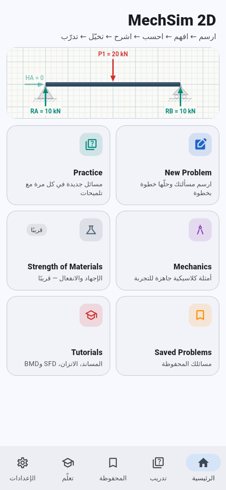 | 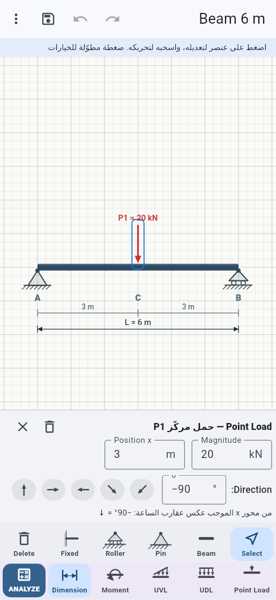 | 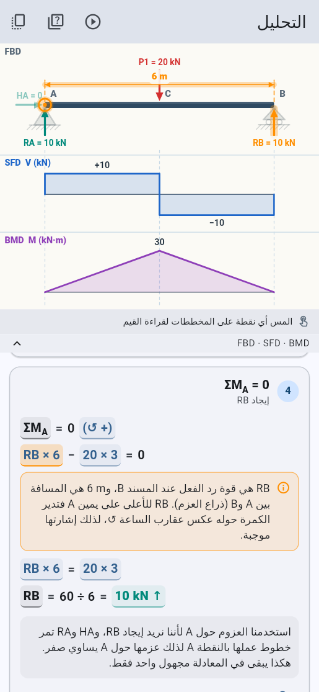 |

| Mmax على BMD | تشغيل الحل: ΣM_A | تشغيل الحل: رسم SFD |
|---|---|---|
| 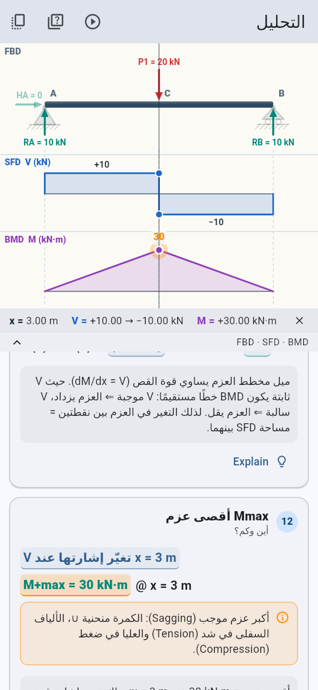 | 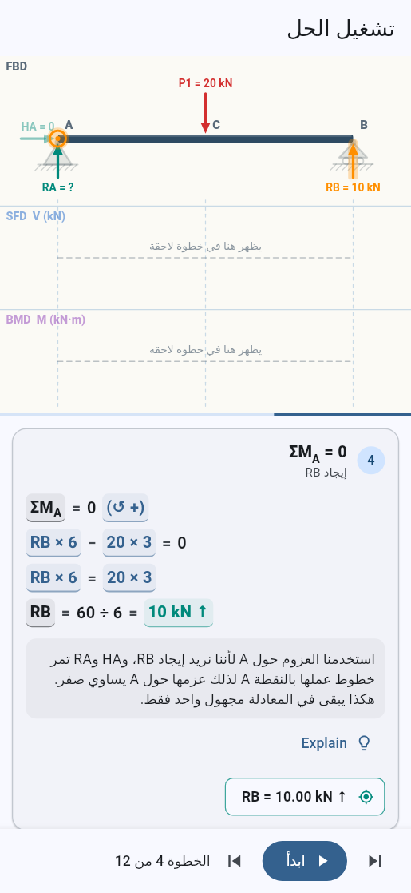 | 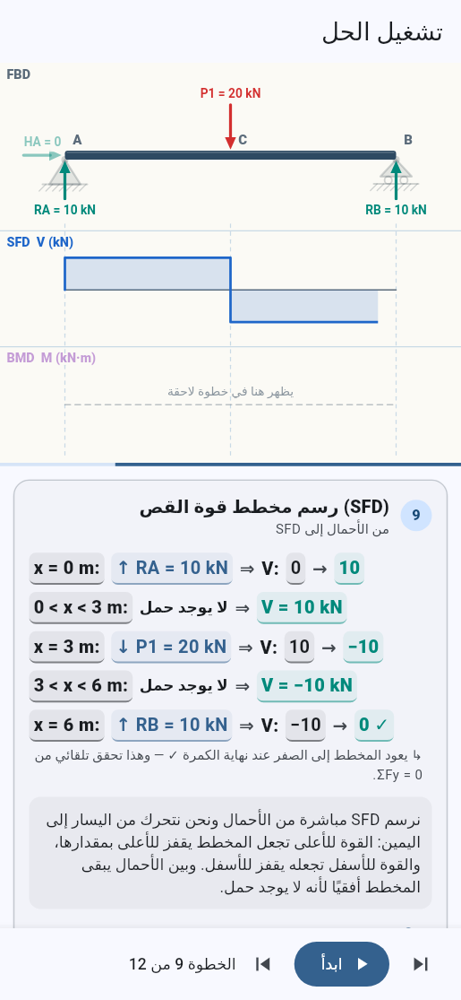 |

| التدريب مع تلميح | كمرة ببروز (رد فعل سالب) | حمل مائل، الوضع الداكن | درس: من الأحمال إلى SFD |
|---|---|---|---|
| 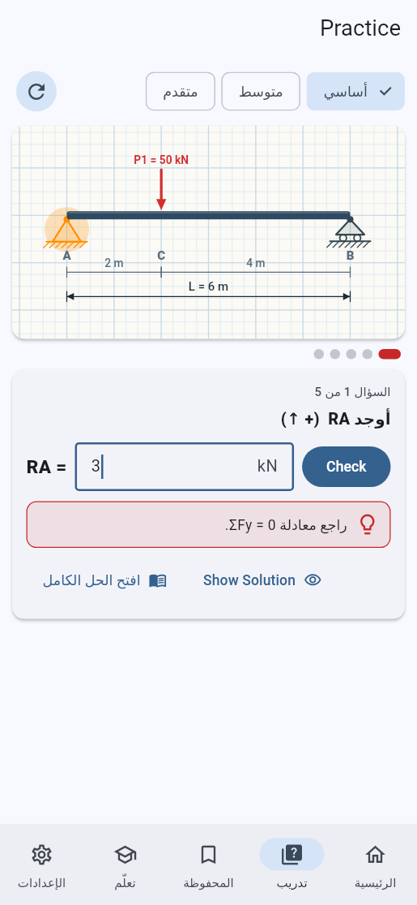 | 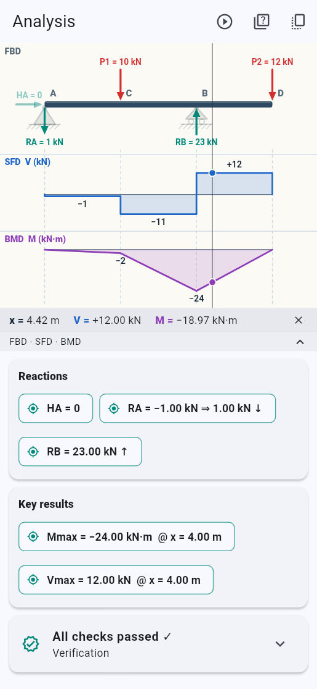 | 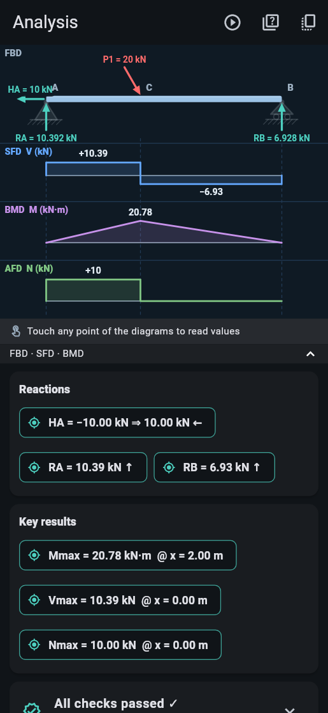 | 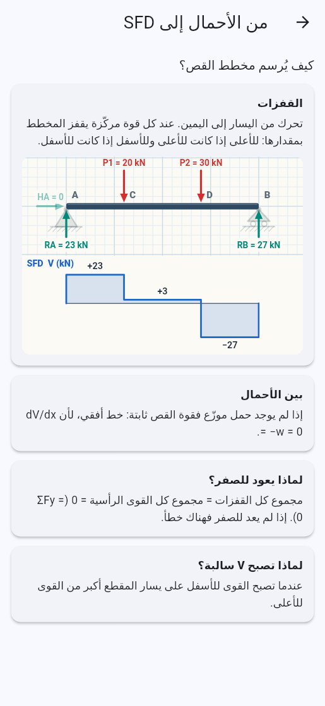 |

| UDL وUVL وعزم وحمل مركّز | المخططات: ميل في SFD وقفزة العزم في BMD | محصّلة الحمل الموزّع على الرسم |
|---|---|---|
| 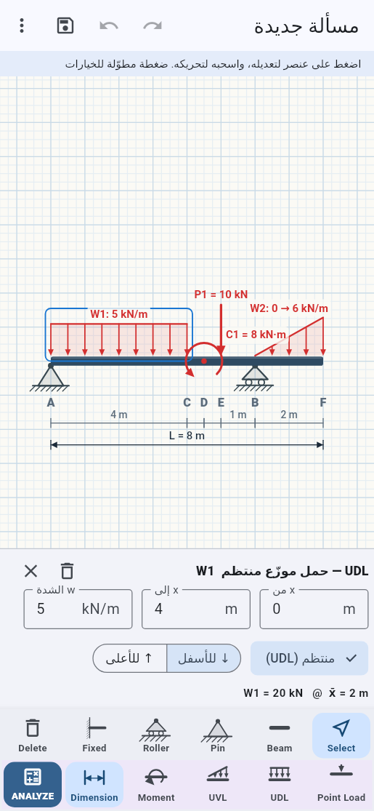 | 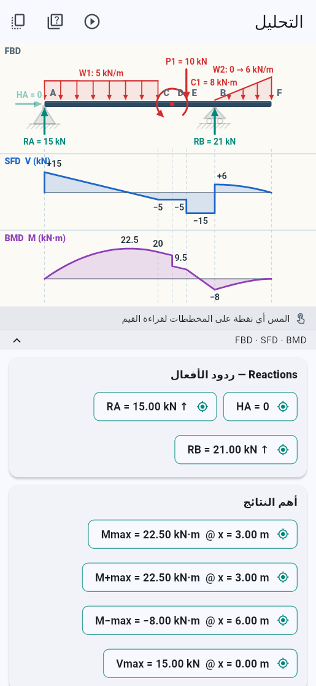 | 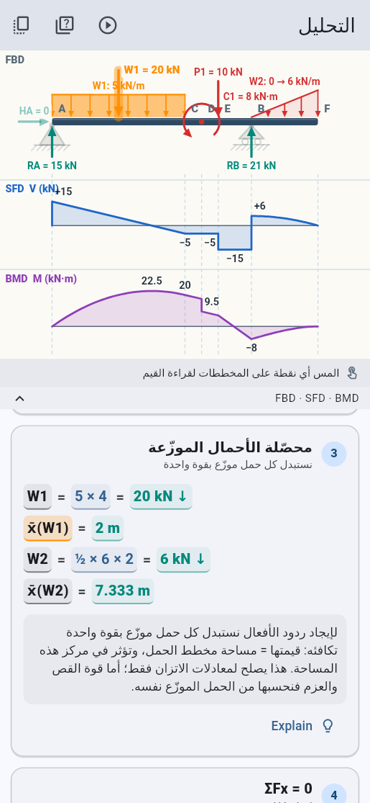 |

| بالعرض: الشاشة كلها للرسم | بالعرض: الخصائص شريط تحت الرسم |
|---|---|
| 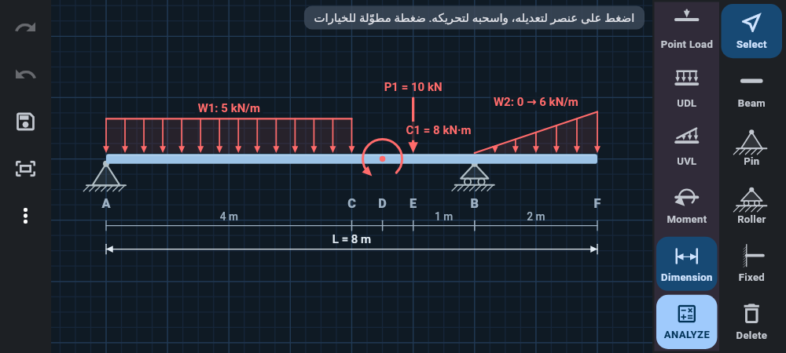 | 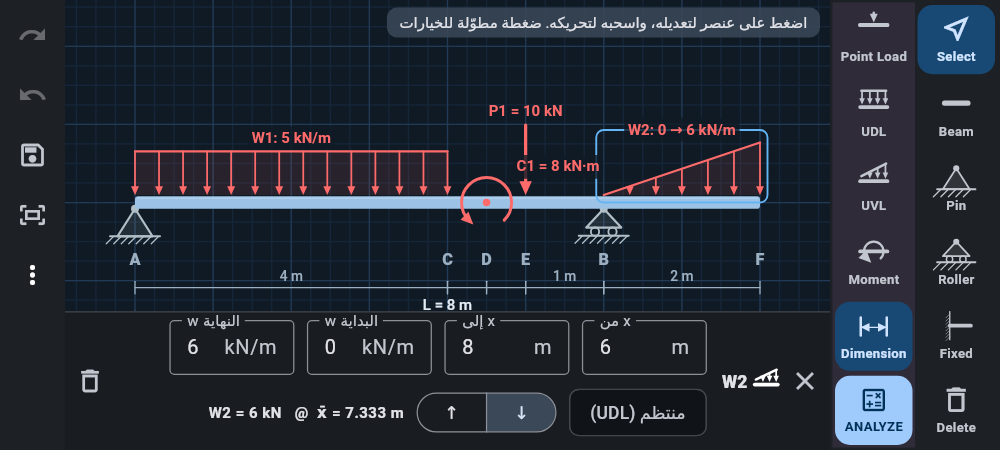 |

| بالعرض: المخططات بجانب الشرح |
|---|
| 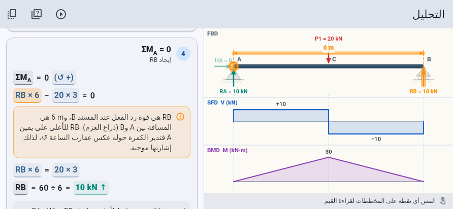 |

الصور مأخوذة من التطبيق نفسه (محرك Flutter الحقيقي) عبر
`test/screenshots_test.dart`، لا من تصميم منفصل.

---

## ماذا يفعل الإصدار الأول

### الرسم (New Problem)
- ورقة هندسية بشبكة مترية تتكيف مع التكبير؛ **Pinch Zoom** و**Pan**.
- **Beam**: اسحب إصبعك أفقيًا فتُرسم الكمرة ويظهر طولها أثناء السحب.
- **كل الأدوات ظاهرة معًا** بلا تمرير: صف للكمرة والمساند (Select، Beam، Pin،
  Roller، Fixed، Delete) وصف للأحمال (Point Load، UDL، UVL، Moment، Dimension)
  ينتهي بزر **ANALYZE**، فلا يغطي الزر أي جزء من الرسم؛ وبالعرض عمودان بجانب الورقة.
- **Pin / Roller / Fixed / Point Load**: اضغط على الكمرة لوضع العنصر.
- **UDL**: اسحب على الكمرة من بداية الحمل إلى نهايته (يظهر طوله أثناء السحب)، أو
  اضغط مرة فيوضع حمل طوله 2 m. القيمة الافتراضية 10 kN/m، وتُغيَّر من الخصائص.
- **UVL**: بنفس الطريقة، ويبدأ من الصفر ويزداد (مثلث). في الخصائص: w البداية وw
  النهاية (مثلث أو شبه منحرف)، وزر «منتظم» يحوّله إلى UDL والعكس.
- **Moment**: اضغط على الكمرة لوضع عزم مركّز؛ في الخصائص قيمته و↺ أو ↻.
- كل حمل موزّع يُعرض في الخصائص مع **محصّلته وموقعها**: `W1 = 20 kN @ x̄ = 2 m`.
- **Drag & Drop**: اسحب أي مسند أو حمل على الكمرة، مع التصاق بالأطراف وبالعناصر
  الأخرى وبشبكة ربع متر.
- **Long Press**: قائمة تعديل / عكس اتجاه الحمل / حذف.
- **Properties**: الطول، الموقع، قيمة الحمل، اتجاهه (↓ ↑ → ← ↘ ↙ أو أي زاوية)؛
  وللحمل الموزّع: من x، إلى x، الشدة w، ↓ أو ↑؛ وللعزم: القيمة و↺/↻.
  الحقول تقبل الأرقام العربية (٢٠، ٢٫٥).
- **Dimension**: سلسلة أبعاد تلقائية بين كل النقاط مع الطول الكلي.
- **Delete، Undo، Redo**، والحفظ باسم.

### التحليل (ANALYZE)
- **FBD وSFD وBMD مرسومة فوق بعضها على محور x واحد**: المس أي نقطة فيظهر خط
  يمر بالمخططات الثلاثة مع القراءة: `x = 3.00 m   V = +10.00 → −10.00 kN   M = +30.00 kN·m`
  (عند قفزة يُعرض V قبلها وبعدها). اللمس يلتصق بنقاط الأحمال.
- **الربط بين الحساب والرسم**: اضغط `RB = 10.00 kN ↑` فيتوهج سهم RB. اضغط حدًا
  في المعادلة مثل `RB × 6` فيتوهج RB وتُعلَّم نقطة العزوم A ويُرسم ذراع العزم
  `6 m`، ويظهر الشرح تحته. اضغط `Mmax` فتُعلَّم القمة على BMD.
- **الشرح خطوة بخطوة**، ولكل خطوة زر **Explain** للشرح الأعمق:
  المسألة ← FBD ← (تحليل الأحمال المائلة) ← (محصّلة الأحمال الموزّعة) ← ΣFx ← ΣM_A ← ΣFy ← تحقق بـ ΣM_B ←
  ردود الأفعال واتجاهاتها ← V(x) بطريقة المقاطع ← رسم SFD ← M(x) ← رسم BMD
  بطريقة المساحات ← Mmax ← (القوة المحورية).
- **التحقق**: بطاقة تعرض كل فحوص الحل (انظر «الدقة» أدناه).
- **▶ تشغيل الحل**: الحمل، ثم أسهم ردود الأفعال كمجاهيل، ثم يظهر كل رد فعل
  عند حلّ معادلته، ثم يُرسم SFD من اليسار لليمين، ثم BMD. Start / Pause / Next /
  Previous.

مثال حقيقي من المحرك للمسألة في الطلب (كمرة 6 m، Pin عند A، Roller عند B،
20 kN في المنتصف):

```
4. ΣM_A = 0  —  إيجاد RB
     ΣM_A = 0 (↺ +)
     RB × 6 − 20 × 3 = 0
     RB × 6 = 20 × 3
     RB = 60 ÷ 6 = 10 kN ↑
   استخدمنا العزوم حول A لأننا نريد إيجاد RB، وHA وRA تمر خطوط عملها بالنقطة A
   لذلك عزمها حول A يساوي صفر. هكذا يبقى في المعادلة مجهول واحد فقط.

5. ΣFy = 0  —  إيجاد RA
     ΣFy = 0 (↑ +)
     RA + RB − 20 = 0
     RA + 10 − 20 = 0
     RA = 20 − 10 = 10 kN ↑
   بعد معرفة RB نستطيع إيجاد RA باستخدام اتزان القوى الرأسية.
```

وعند الضغط على `RB × 6`:
«RB هي قوة رد الفعل عند المسند B، و6 m هي المسافة بين A وB (ذراع العزم). RB
للأعلى على يمين A فتدير الكمرة حوله عكس عقارب الساعة ↺، لذلك إشارتها موجبة.»

وعلى `20 × 3`: «20 kN هي قيمة الحمل P1 و3 m هي المسافة من A إلى الحمل. الحمل
يدير الكمرة حول A مع عقارب الساعة ↻، لذلك إشارته سالبة.»

ترتيب المعادلات **ليس ثابتًا في الكود**: المحرك يختار في كل مرحلة معادلة فيها
مجهول واحد فقط، فيعمل نفس الشرح مع Roller على اليسار وPin على اليمين، أو مساند
داخل الكمرة، أو كمرة كابولية (ΣFx ← ΣFy ← ΣM حول المسند الثابت).

### التدريب (Practice)
- مسائل مولّدة بثلاثة مستويات: أساسي (حمل واحد)، متوسط (حملان، بروز، كابولي)،
  متقدم (بروز من الجانبين، حمل للأعلى، حمل مائل).
- الأسئلة: ردود الأفعال، V عند مقطع، Mmax بإشارته، وموقعه.
- عند الخطأ لا يظهر الحل، بل **تلميح يخمّن الخطأ**: إشارة معكوسة، وحدة أخرى،
  رد فعل المسند الآخر («هذه قيمة RB وليست RA. راجع معادلة ΣFy = 0»)، الحمل كله
  على مسند واحد، تقسيم الحمل بالتساوي، قيمة القص في جزء آخر، عزم ليس الأكبر.
- **Show Solution** يكشف الإجابة، و«افتح الحل الكامل» يفتح التحليل على الخطوة
  التي تشرحها بالضبط.
- يمكن التدرّب على أي مسألة رسمتها من زر «اختبرني» في شاشة التحليل.

### بقية الأقسام
- **Mechanics**: ثمانية أمثلة كلاسيكية (منتصف، غير متماثل، حملان، بروز، كابولي
  يسار/يمين، حمل مائل، حمل للأعلى) تُفتح للتعديل أو التحليل مباشرة.
- **Tutorials**: ستة دروس (المساند، FBD، الاتزان، اصطلاح الإشارات، من الأحمال
  إلى SFD، من SFD إلى BMD) برسومات محسوبة من مسائل حقيقية.
- **Saved Problems**: حفظ واسترجاع، حذف بالسحب مع تراجع.
- **الوضع الأفقي (بالعرض)**: كل الشاشات لها تصميم أفقي، **بملء الشاشة** (يختفي شريط
  الحالة وأزرار النظام؛ اسحب من حافة الشاشة لإظهارها لحظة). في الرسم لا يوجد شريط
  علوي: الأدوات عمودان على جانب، والرجوع والتراجع والحفظ عمود رفيع على الجانب الآخر،
  وخصائص العنصر المختار شريط قصير تحت الرسم، والتلميح سطر واحد فوق الورقة. وفي
  التحليل والتشغيل تكون المخططات بجانب الشرح، وفي
  التدريب المسألة بجانب السؤال، والتنقل شريط جانبي. من الإعدادات «اتجاه الشاشة:
  بالعرض» يُبقي التطبيق أفقيًا حتى لو كان تدوير الهاتف مقفلًا.
- **Settings**: اتجاه الشاشة، اللغة، الوحدات (N، kN، mm، cm، m، N·mm، N·m، kN·m)، اصطلاح
  الإشارات (↑/↓، →/←، ↺/↻) — يغيّر كتابة المعادلات لا النتائج — والمظهر.

---

## البنية (Architecture)

المشروع جزءان مستقلان:

```
mechsim/
├── core/   mechsim_core — Dart خالص بدون Flutter: كل الرياضيات والشرح
└── app/    mechsim      — واجهة Flutter: الرسم والتفاعل والربط
```

المحرك لا يعرف شيئًا عن Flutter، فيعمل كما هو على الهاتف وعلى Windows/Linux،
وفي سطر الأوامر، أو على أي جهاز يشغّل Dart (حاسبة بشاشة نصية مثلًا):

```bash
cd mechsim/core
dart run bin/mechsim.dart --length 6 --pin 0 --roller 6 --load 20@3
dart run bin/mechsim.dart --length 4 --fixed 0 --load 10@4 --lang en --units N-mm
```

### الأجزاء كما طُلبت، وأين هي

| الجزء | المكان | ماذا يفعل |
|---|---|---|
| Unit Conversion Engine | `core/lib/src/units/` | الوحدات والتحويل والتنسيق وقراءة الأرقام العربية. كل شيء داخل المحرك بوحدات SI |
| Physics / Engineering Engine | `core/lib/src/model/`، `statics/actions.dart` | الكمرة والمساند والأحمال (نماذج immutable)، والقوى والعزوم المؤثرة |
| Calculation Engine | `core/lib/src/statics/`، `diagrams/internal_forces.dart` | بناء معادلات الاتزان حدًا حدًا، حلها، تشخيص عدم الاستقرار، وV وM وN بطريقة المقاطع |
| Graph Engine | `core/lib/src/diagrams/graph.dart`، `polynomial.dart` | دوال متعددة الحدود قطعةً قطعة، القفزات، القيم المهمة، القيم القصوى |
| Validation | `core/lib/src/validation/` | فحص كل حل (انظر أدناه) |
| Educational Explanation Engine | `core/lib/src/explain/` | الخطوات، ترتيب المعادلات، شرح كل حد، الأهداف المرسومة، مراحل التشغيل، العربية والإنجليزية |
| Problem Generator | `core/lib/src/practice/` | توليد المسائل، الأسئلة، تشخيص الأخطاء |
| Storage | `core/lib/src/storage/` (+ `io.dart`) | JSON بإصدار، واجهة `ProblemRepository`، تخزين في ملف بكتابة آمنة |
| Drawing Engine | `app/lib/drawing/` | CustomPainter: الرموز، الكمرة، الأسهم، الأبعاد، التوهج، المخططات المترابطة، الشبكة، Hit testing |
| UI | `app/lib/ui/`، `app/lib/state/` | الشاشات، أدوات الرسم، Undo/Redo، الربط عبر `HighlightController` |

### كيف يرتبط الشرح بالرسم
المحرك لا يرسم؛ هو **يسمّي** ما يشير إليه كل جزء من الشرح (`Highlight`): رد فعل،
حمل، مسند، نقطة عزوم، ذراع عزم، مقطع، نقطة أو مدى على مخطط. كل `MathToken` في
معادلة يحمل شرحه وأهدافه، وكل خطوة تحمل `Reveal` (ماذا يظهر في مرحلة التشغيل).
الواجهة تنشر ما لُمس في `HighlightController`، وكل رسمة للمسألة تستمع إليه.

### الدقة أهم من الشكل
- **لا شيء مكتوب يدويًا**: المعادلات تُبنى من المسألة، وتُحل بمصفوفة 3×3
  (Gaussian elimination)، بينما الشرح يحل نفس المعادلات واحدة واحدة. الاختبارات
  تقارن الطريقين.
- **بعد كل حل** يتحقق المحرك من: ΣFx = 0، ΣFy = 0، ΣM = 0 حول الطرفين (نقطتان لم
  يستخدمهما الحل)، رجوع SFD وBMD والقوة المحورية للصفر، قفزات SFD = الأحمال
  المركّزة، قفزات BMD = العزوم المركّزة، dM/dx = V في كل جزء، والتغير في M =
  مساحة SFD. تظهر هذه الفحوص للطالب في بطاقة «التحقق».
- **الاختبارات**: 84 اختبارًا للمحرك تشمل حالات معروفة بحلول مغلقة (Pb/L، Pab/L،
  PL للكابولي، البروز، الحمل المائل، الحمل للأعلى، الحمل فوق المسند، عدم
  الاستقرار وعدم التحديد)، و**600 كمرة عشوائية** تُفحص كل واحدة بثلاث طرق مستقلة
  (المدقق، إعادة حل المعادلات خطوة خطوة، وحساب V وM من الجزء الأيمن من الكمرة
  بدل الأيسر)، و450 مسألة تدريب مولّدة. و8 اختبارات للواجهة تقود التطبيق كما
  يفعل الطالب: رسم الكمرة بالسحب، وضع المساند والحمل باللمس، تعديل القيمة،
  Undo/Redo، ANALYZE، لمس النتائج والحدود، التدريب، التشغيل، الحفظ، تغيير اللغة.

### اصطلاح الإشارات
- **معادلات الاتزان**: افتراضيًا ↑ و→ و↺ موجبة، وقابلة للتغيير من الإعدادات. ردود
  الأفعال تُفترض دائمًا في الاتجاه الموجب الفيزيائي؛ النتيجة السالبة تُشرح
  («تعمل فعليًا ↓، عكس ما افترضنا»).
- **المخططات** (ثابت، اصطلاح الكتب المعتاد): V موجبة = مجموع القوى للأعلى على يسار
  المقطع. M موجب = Sagging (الألياف السفلى في شد). N موجبة = شد. القيم الموجبة
  تُرسم فوق المحور.

---

## التشغيل والبناء

**APK للهاتف — رابط مباشر**: افتح هذا الرابط من متصفح الهاتف ثم ثبّت الملف:
<https://github.com/Muamn7/Muamn7/releases/download/mechsim-latest/MechSim2D.apk>
(يُستبدل تلقائيًا بأحدث نسخة بعد كل بناء ناجح.)

**كيف يُبنى**: كل push يمسّ `mechsim/` يشغّل workflow
[`MechSim 2D`](../.github/workflows/mechsim.yml) على GitHub Actions: اختبارات
المحرك، اختبارات الواجهة، ثم بناء `app-release.apk` (موقّع بمفتاح debug حتى
يُعدّ مفتاح متجر) ويُرفع في قسم **Artifacts** باسم `mechsim-2d-apk`، ويُنشر في Release باسم `mechsim-latest` (pre-release، فلا يغطي إصدارات اللعبة). (بيئة
التطوير هنا لا تصل إلى `dl.google.com`، لذلك يُبنى الـ APK هناك.)

**محليًا** (Flutter 3.47 أو أحدث):

```bash
cd mechsim/core && dart pub get && dart test     # المحرك
cd ../app && flutter pub get && flutter test     # الواجهة
flutter run                                       # هاتف/محاكي، أو -d linux / -d windows
```

المنصّات المُعدّة: Android وiOS وWindows وLinux وmacOS. لا يوجد Web، كما طُلب.

---

## المستقبل: أين تُضاف الأقسام القادمة

البنية مصممة لكي تُضاف هذه دون إعادة كتابة ما هو موجود:

- **أنواع أحمال جديدة** (مثل حمل موزّع على شكل قطع مكافئ): `Load` عائلة `sealed`،
  فإضافة نوع جديد تجعل المترجم يشير لكل مكان يجب أن يتعلّمه. UDL وUVL وMoment
  أُضيفت بهذه الطريقة: المخططات دوال متعددة الحدود قطعةً قطعة (UDL ⇐ V خطي وM
  تربيعي، UVL ⇐ V تربيعي وM تكعيبي)، والفاحص يفحص dV/dx = q وdM/dx = V.
- **Strength of Materials** (Tension، Compression، Shear، Bending Stress σ = My/I،
  Torsion τ = Tr/J): وحدات الإجهاد والمساحة موجودة في محرك الوحدات (1 MPa =
  1 N/mm² مُختبَرة). يُضاف كوحدة جديدة في `core` بنفس نمط
  «حساب ← خطوات ← Highlight»، مع رسومات المقطع في `app/lib/drawing`.
- **Deflection، Mohr's Circle، Centroid، Moment of Inertia، Column Buckling،
  Trusses، Frames، Cables، Friction، Machine Elements**: كل واحد وحدة في `core`
  بنموذجها وحلّالها وشرحها، وشاشة في `app`. أدوات الرسم (`Symbols`، `SheetView`،
  `HighlightController`) قابلة لإعادة الاستخدام.
- **الكمرات غير المحددة استاتيكيًا**: المحرك يكتشفها ويحسب درجة عدم التحديد ويشرح
  السبب؛ حلّها يأتي مع Deflection.

## ما لم يُنفَّذ بعد (بوضوح)
- قسم Strength of Materials: مقفل في الواجهة («قريبًا»).
- الكمرات غير المحددة استاتيكيًا: تُشخَّص ولا تُحل.
- كمرة واحدة أفقية في كل مسألة.
- مفتاح توقيع للمتجر.
